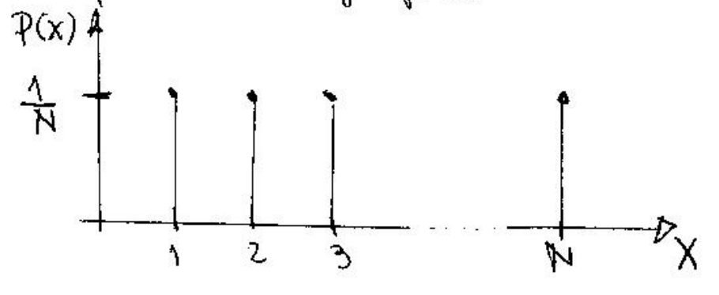
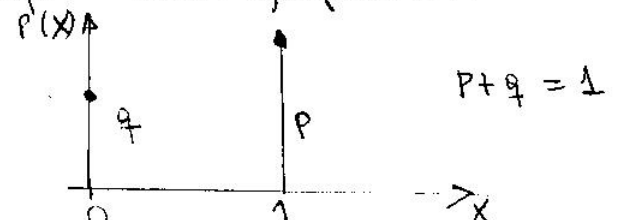
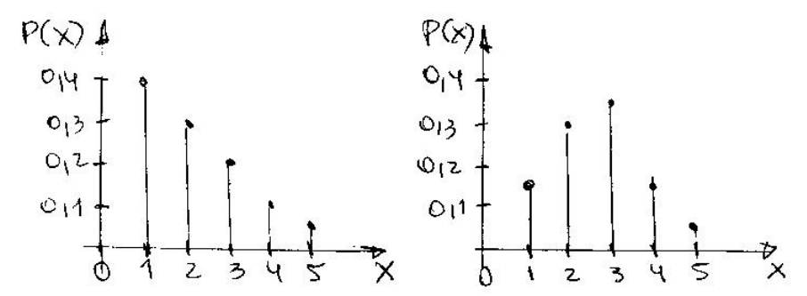

#+title: Distribuciones

* Distribuciones Discretas de Probabilidad

Para describir el comporamiento y obtener la probabilidad de un determinado
suceso, se han construido modelos específicos de probabilidad, nacidos del
estudio, observación y la experimentación.

Cada estudio o experimento se pude encuadrar o aproximarse a un modelo de
probabilidad.

** Distribución Uniforme Discreta

Una variable aleatoria discreta X sigue una distribución uniforme si:

#+BEGIN_EXPORT latex
\[
P(X = x) = \begin{cases}
\frac{1}{N}, & \text{para $x = 1, 2, \dots N$} \\
  0, & \text{en otro caso}
  \end{cases}
\]
#+END_EXPORT

Su representación gráfica es:

La esperanza y varianza se calculan:

#+BEGIN_EXPORT latex
\begin{align*}
E(x) = \frac{N + 1}{2} \\
V(x) = \frac{N^2 - 1}{12}
\end{align*}
#+END_EXPORT

Ejemplo, se arroja un dado balanceado una vez. Sea X la variable aleatoria que
representa el resultado, para toda x $P(x) = 1/6$.

Si calculamos $E(x) = (6 + 1) / 2 = 3.5$. $V(x) = (36 - 1) / 12 = 2.91$.

** Distribución de Bernoulli

Una variable aleatoria discreta $X$ sigue una distribución de Bernoulli si:

#+BEGIN_EXPORT latex
\[
P(X = x) =
\begin{cases}
        p^x(1 - p)^{1 - x}, & \text{para $x = 0 \lor x = 1$ y $0 \leq p \leq 1$} \\
        0, & \text{para otros valores de $x$.}
\end{cases}
\]
#+END_EXPORT

Su representación gráfica es:

La varianza y esperanza se calculan:

#+BEGIN_EXPORT latex
\begin{align*}
E(x) = p \\
V(x) = pq
\end{align*}
#+END_EXPORT

Ejemplo. Una máquina produce tornillos con un porcentaje de no-defectuosos del
97%. Se selecciona un tornillo al azar. Cuál es la probabilidad de que sea
no defectuoso?

x = 0 sería defectuoso y x = 1 no defectuoso. Por lo tanto:

#+BEGIN_EXPORT latex
\begin{align*}
P(X = 0) = (.97)^0(1 - .97)^1 = .03 \\
P(X = 1) = (.97)^1(.03)^0 = .97
\end{align*}
#+END_EXPORT

Si calculamos su esperanza y varianza:

#+BEGIN_EXPORT latex
\begin{align*}
E(x) = .97 \\
V(x) = (.97)(.03) \approx 0.029
\end{align*}
#+END_EXPORT

** Distribución Binomial

Una variable aleatoria discreta $X$ sigue una distribución binomial si:

#+BEGIN_EXPORT latex
\[
P(X = x) =
\begin{cases}
        \binom{n}{x} p^x(1 - p)^{n - x}, & \text{para $x = 0, 1, \dots n$} \\
        0, & \text{para otros valores de $x$.}
\end{cases}
\]
#+END_EXPORT

Una representación gráfica para $n = 5$ y $p = .25$; y para $n= 5$ y $p = .5$ es:

Los gráficos cambian para cada valor de n y p, porque estos son los parámetros
que caracterizan a la distribución.

La esperanza y varianza son:

#+BEGIN_EXPORT latex
\begin{align*}
E(x) = np \\
V(x) = npq
\end{align*}
#+END_EXPORT

Esta distribución se usa con frecuencia, por lo que conviene señalar ciertas
consideraciones.

Es el modelo probabilístico adecuado para describir fenómenos o experimentos
con las siguientes características.

1. Se realizan $n$ observaciones, teniendo cada una dos resultados posibles,
   por ejemplo, /éxito/ y /fracaso/.

2. Cada prueba es independiente de las restantes, o sea que el resultado de
   una es estadísticamente independiente de los resultados de las restantes.

3. /E/ y /F/ son eventos mutuamente excluyentes.

4. La probabilidad de /E/ es constante para todas las pruebas. $p = P(E)$ es
   constante y, por lo tanto, $q = 1 - p$ también.

Existen tablas para calcular probabilidades binomiales en función de diferentes
valores de $n$, $p$ y $x$, como también para calcular probabilidades acumuladas.

Para las probabilidades acumuladas es conveniente usar la expresión:

#+BEGIN_EXPORT latex
\begin{align*}
P(x \leq r) = B(r, p, n) = \sum_{x = 0}^{r} \binom{n}{x} p^x q^{n-x}
\end{align*}
#+END_EXPORT

Siendo naturalmente $r$ un valor entre 0 y $n$. $B(r, p, n)$ indica probabilidad
acumulada en una distribución binomial, con probabilidad $p$ y valor máximo $n$.

Cuando $n=1$, la distribución binomial coincide con Bernoulli.

Ejemplo. Un vendedor de semillas garantiza una germinación del 90%. Un aficionado
compra 50 semillas. ¿Cuál es la probabilidad de que germinen 40? ¿Cuál es la
probabilidad de que geminen al menos 40?

#+BEGIN_EXPORT latex
\begin{align*}
P(X = 40, .9, 50) = \binom{50}{40}(.9)^{40}(.1)^{10} = .015
\end{align*}
#+END_EXPORT

La probabilidad de que germinen 40 es 1.5%.

Ahora, la probabilidad acumulada de que germinen al menos 40 es la sumatoria
de este mismo cálculo, desde $n = 40$ hasta $n = 50$.

Si calculamos su esperanza y varianza:

#+BEGIN_EXPORT latex
\begin{align*}
E(x) = .97 \\
V(x) = (.97)(.03) \approx 0.029
\end{align*}
#+END_EXPORT

** Distribución Polinomial

Pertenece a las distribuciones multivariantes de probabilidad, porque es el
modelo que describe el comportamiento de $k$ variables aleatorias.
Se puede pensar como la generalización de la distribución binomial.

Dado un experimento aleatorio repetido $n$ veces, con $k$ resultados posibles,
mutuamente excluyentes, con $P_1 ... P_k$ representando las probabilidades de
cada categoría. Si $x_1$ es la variable aleatoria que reprenta el número de
veces que se obtiene el resultado $R_1$, y se verifican las restricciones:

#+BEGIN_EXPORT latex
\begin{align*}
P_1 + P_2 + \dots + P_k = 1 &\qquad  0 \leq P_i \leq 1 \\
x_1 + x_2 + \dots + x_k = n &\qquad  0 \leq x_i \leq n
\end{align*}
#+END_EXPORT

Entonces:
