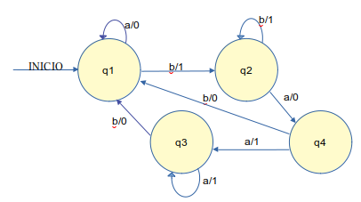
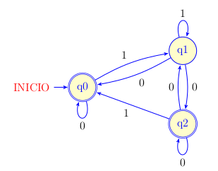
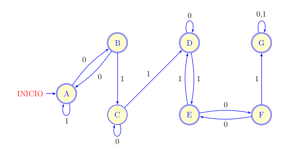

1. Hallar gramática que genere el siguiente lenguaje. Expresarlo formalmente.
   No olvidar indicar: símbolos terminales, no terminales, reglas de
   producción:
  1) $L = \{ 1^{2i} 2^i 3 \, con \, i \geq 0\}$

2. Dada la siguiente gramática, teniendo en cuenta jerarquía de gramáticas de
   Chomsky, indicar: de qué tipo de gramática se trata. Por qué llega a esa
   conclusión.
  - $G = (\Sigma T, \Sigma N, S, P)$
  - $\Sigma T = \{ a, b \}$
  - $\Sigma N = \{ S, X, Y, W \}$
  - $S = S$
  - $P = \{ S ::= aX, X ::= bW, X ::= a, W ::= WaX$

3. Hallar en cada caso al menos 10 palabras generadas por cada expresión
   regular:

  #) $a^*|b(c|d)^*(r|q)$

  #) $(a|c)^*b$

  #) $0^*|12^*$

4. Dada la definición formal de autómata, se pide:

  #) Hallar matriz de transiciones

  #) construir autómata (diagrama de transiciones)

  - $A=(K, \Sigma, W, F, f)$
  - $K = \{ W, X, Y, Z \}$
  - $\Sigma = \{ a, b \}$
  - $F = \{ Y \}$
  - $f = \{ ((W, a), Y), ((W, b), X), ((X, a), Y), ((X, b), X),
            ((Y, a), Z), ((Y, b), X), ((Z, a), Y), ((Z, b), X) \}$

5. Dado el siguiente autómata, indicar si es máquina de Mealy o Moore.
   Justificar.

{ width=75% }
\

6. Convertir AFND en AFD. Representar diagrama de transiciones del AFD hallado.

{ latex-placement="ht" width=75% }
\

7. Dado AFD, se pide:

  #) Construir matriz de transiciones.

  #) Reducir a la mínima cantidad de estados. Poner todas las matrices
  auxiliares a medida que lo trabajan, el proceso. Si no se muetra el proceso,
  el ejercicio no es válido).

  #) Construir diagrama de transiciones del AFD mínimo.

{ latex-placement="ht" width=75% }
\

