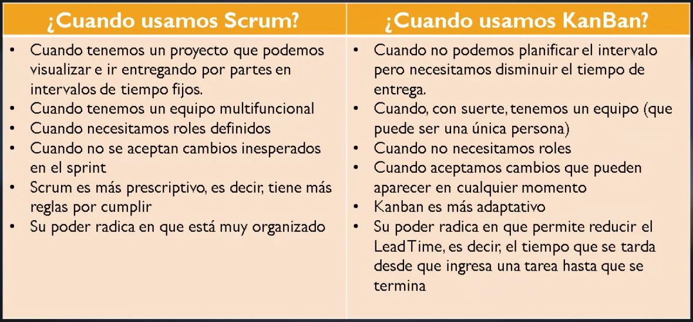

= Notas de Clase, Ingeniería de Software
Daniel

== Primera Clase

== Segunda Clase

== Tercera Clase, 29 de Agosto

Pasamos a otro revisar otra metodología ágil: *Kanban*.

=== Kanban

Primera observación: hay gente y papelitos.

.Definición
Nombre japonés, significa tarjeta visual. Nace en Toyota. Venían utilizando
*Lean* y desde ahí pasan a *Kanban*. Sería una versión mejorada de _Lean_.
Al día de la fecha siguen usando Kanban.

.Objetivo.
Gestionar de manera general cómo se van completando las tareas. Ayuda a evitar
dos problemas:

* Cuellos de botella. Acumulación de tareas en una sola persona, que teniendo
muchas cosas para hacer, se retrasa.

* Tiempo muerto. Persona del equipo sin tareas asignadas. No está colaborando.

En _Scrum_ estas situaciones no se pueden visualizar claramente. La única manera
en que se vería es con alguien manifestándolo en la _Daily_.

.Principios.
- Calidad garantizada. No importa el tiempo, sino la calidad. No se premia la
rapidez. Muchas veces cuesta más arreglar que hacer con errores. Lo que se hace,
se hace una vez y bien. Se estudia qué es lo mejor y se hace una sola vez. No se
busca el ensayo y error.
- Reducción del desperdicio. Principio YAGNI. Hacemos lo justo y necesario.  Y
lo hacemos bien.
- Mejora contínua. No es solo un método de gestión. Es un sistema de mejora en
el desarrollo de proyectos.
- Flexibilidad. Lo que se va a realizar se decide en el _backlog_, o tareas
pendientes acumuladas.

.Pasos para aplicar la estrategia
- Todos somos integrantes del equipo. No hay nadie que de órdenes, pero 
puede haber un _dinamizador_, que se encarga de resolver problemas.
- Qué vamos a utilizar. Un tablero, _Kanban Board_ y tarjetas.
- Vamos a hacer reuniones, 15 minutos como máximo, de pie y mirándonos a la 
cara. Tenemos reuniones diarias de ser necesario, retrospectivas de ser 
necesario. 
- Elemento clave es wl WIP (_Work in Progress_). Definir cuántas tareas, como
máximo, se puede realizar en cada fase.
- Definir el flujo de trabajo de los proyectos.
- Visualizar las fases del ciclo.

El tablero Kanban clásico se divide en tres columnas. La primera contiene las 
_Tareas por Hacer_. La del medio contiene las _Tareas en Progreso_. La de la 
derecha son las _Tareas Terminadas_. Cada uno identifica un color de papel. 
Cuando detecto una tarea, incorporo a la primera. Cuando empiezo una tarea, 
paso a la segunda columna. Cuando termino, va a la del final.

La del medio es el Work In Progress. WIP. Ponemos un límite al WIP. Por ejemplo,
10. Viendo el tablero, se pueden identificar tiempos muertos: no hay ninguna de 
un determinado color. Puedo identificar cuellos de botella: hay muchos papelitos 
de un mismo color.

Lema *Stop Starting, Start Finishing*. Lo que hacemos, lo hacemos bien de una.
No tenemos margen de error. No empezamos una tarea nueva hasta no finalizar la 
anterior. Esto es la aplicación de un principio de las metodologías
tradicionales: como la cascada, hasta que algo no esté, no pasamos a lo
siguiente.

.Conformación de un equipo Kanban. 
Equipo compuesto por una persona o cincuenta.  Una sola persona puede aplicar
Kanban. Los equipos remotos puede utilizar soluciones de Software como Trello.

=== Scrumban

Qué criterios podemos usar. Calidad o Tiempo: Kanban o Scrum.

El cliente prioriza calidad, por lo tanto, empezamos a trabajar con Kanban. Se
vuelve caótico. Qué hacemos.

Como Kanban es flexible, le puedo agregar cosas de Scrum. Porque Kanban es
_flexible_. Por ejemplo, estamos teniendo problemas de organización.
Incorporamos un _Product Owner_. O necesitamos reuniones más periódicas,
incorporamos el concepto de _Daily_.

En cuanto incorporamos algo de Scrum a Kanban, hablamos de Scrumban. No es un 
cambio de metodología. Por eso se puede hacer.
