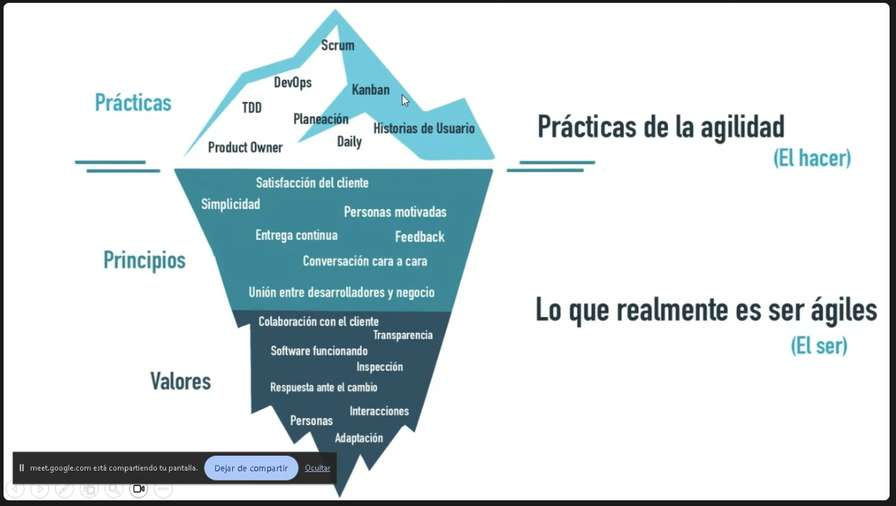

= Notas de Clase, Ingeniería de Software
Daniel
:stem:

== TODO

. Acomodar notas de clases
. Resumir apuntes

== Primera Clase

== Segunda Clase

== Tercera Clase, 29 de Agosto

Pasamos a otro revisar otra metodología ágil: *Kanban*.

=== Kanban

Primera observación: hay gente y papelitos.

.Definición
Nombre japonés, significa tarjeta visual. Nace en Toyota. Venían utilizando
*Lean* y desde ahí pasan a *Kanban*. Sería una versión mejorada de _Lean_.
Al día de la fecha siguen usando Kanban.

.Objetivo.
Gestionar de manera general cómo se van completando las tareas. Ayuda a evitar
dos problemas:

* Cuellos de botella. Acumulación de tareas en una sola persona, que teniendo
muchas cosas para hacer, se retrasa.

* Tiempo muerto. Persona del equipo sin tareas asignadas. No está colaborando.

En _Scrum_ estas situaciones no se pueden visualizar claramente. La única manera
en que se vería es con alguien manifestándolo en la _Daily_.

.Principios.
- Calidad garantizada. No importa el tiempo, sino la calidad. No se premia la
rapidez. Muchas veces cuesta más arreglar que hacer con errores. Lo que se hace,
se hace una vez y bien. Se estudia qué es lo mejor y se hace una sola vez. No se
busca el ensayo y error.
- Reducción del desperdicio. Principio YAGNI. Hacemos lo justo y necesario.  Y
lo hacemos bien.
- Mejora contínua. No es solo un método de gestión. Es un sistema de mejora en
el desarrollo de proyectos.
- Flexibilidad. Lo que se va a realizar se decide en el _backlog_, o tareas
pendientes acumuladas.

.Pasos para aplicar la estrategia
- Todos somos integrantes del equipo. No hay nadie que de órdenes, pero 
puede haber un _dinamizador_, que se encarga de resolver problemas.
- Qué vamos a utilizar. Un tablero, _Kanban Board_ y tarjetas.
- Vamos a hacer reuniones, 15 minutos como máximo, de pie y mirándonos a la 
cara. Tenemos reuniones diarias de ser necesario, retrospectivas de ser 
necesario. 
- Elemento clave es wl WIP (_Work in Progress_). Definir cuántas tareas, como
máximo, se puede realizar en cada fase.
- Definir el flujo de trabajo de los proyectos.
- Visualizar las fases del ciclo.

El tablero Kanban clásico se divide en tres columnas. La primera contiene las 
_Tareas por Hacer_. La del medio contiene las _Tareas en Progreso_. La de la 
derecha son las _Tareas Terminadas_. Cada uno identifica un color de papel. 
Cuando detecto una tarea, incorporo a la primera. Cuando empiezo una tarea, 
paso a la segunda columna. Cuando termino, va a la del final.

La del medio es el Work In Progress. WIP. Ponemos un límite al WIP. Por ejemplo,
10. Viendo el tablero, se pueden identificar tiempos muertos: no hay ninguna de 
un determinado color. Puedo identificar cuellos de botella: hay muchos papelitos 
de un mismo color.

Lema *Stop Starting, Start Finishing*. Lo que hacemos, lo hacemos bien de una.
No tenemos margen de error. No empezamos una tarea nueva hasta no finalizar la 
anterior. Esto es la aplicación de un principio de las metodologías
tradicionales: como la cascada, hasta que algo no esté, no pasamos a lo
siguiente.

.Conformación de un equipo Kanban. 
Equipo compuesto por una persona o cincuenta.  Una sola persona puede aplicar
Kanban. Los equipos remotos puede utilizar soluciones de Software como Trello.

=== Scrumban

Qué criterios podemos usar. Calidad o Tiempo: Kanban o Scrum.

El cliente prioriza calidad, por lo tanto, empezamos a trabajar con Kanban. Se
vuelve caótico. Qué hacemos.

image::image.png[Cuadro que compara Scrum con Kanban]

Como Kanban es flexible, le puedo agregar cosas de Scrum. Porque Kanban es
_flexible_. Por ejemplo, estamos teniendo problemas de organización.
Incorporamos un _Product Owner_. O necesitamos reuniones más periódicas,
incorporamos el concepto de _Daily_.

En cuanto incorporamos algo de Scrum a Kanban, hablamos de Scrumban. No es un 
cambio de metodología. Por eso se puede hacer.

== Cuarta clase, 5 de septiembre

=== Lean

Metodología ligera, sin muchas complicaciones. El enfoque es la eficiencia, el
aprendizaje contínuo y la entrega rápida de valor. Es decir, comparte algunos 
aspectos con SCRUM (entrega rápida), comparte valores con Kanban (eficiencia, 
aprendizaje continuo). 

Nace en Toyota, década del 50. Se basa en la eliminación de desperdicios y la 
mejora contínua. Cada vez que hacemos algo lo hacemos mejor. Lo que hacemos es 
adaptar los principios de Lean a la industria del software. Buscamos maximizar
valor, minimizar desperdicios.

.Principios
. Elminar desperdicios
. Ampliar aprendizaje
. Decidir lo más tarde posible
. Entregar lo más rápido posible
. Construir calidad desde el inicio
. Ver el todo

.Eliminar desperdicio
Lo que no agrega valor se elimina. Código innecesario, funcionalidades no
usadas, etc.

.Ampliar aprendizaje
Validación temprana, ciclos cortos de retroalimentación, entregas frecuentes y 
prototipos. Sin pulir detalles.

.Decidir lo más tarde posible
No tomamos decisiones a las apuradas. Las tomamos cuando se dispone de la mayor
cantidad posible de información.

.Entregar lo más rápido posible
Entregas tempranas que generen _feedback_ y adaptarse a las necesidades del 
cliente.

.Empoderar al equipo
Equipos autónomos, colaborativos y responsables de sus decisiones.

.Construir calidad desde el inicio
Integración contínua, pruebas automatizadas y prácticas de desarrollo que 
aseguren calidad desde el principio. 

.Ver el todo
Optimizamos el sistema completo, no partes individuales. Se busca la eficiencia 
general.

.Ventajas
- Menor tiempo de entrega
- Mayor calidad
- Mejor colaboración
- Satisfacción del cliente

.Requerimientos
- Cambio cultural profundo
- Gran compromiso organizacional
- Demanda liderazgo distribuido y madurez 

=== Extreme Programming (XP)

No abarca a toda la organización ni al diseño de un proyecto. Es exclusiva del 
equipo que se dedica a programar. Es decir, abarca solo la etapa de desarrollo 
propiamente dicha

Metodología creada por Kent Beck. Busca mejorar la calidad del software.

.Objetivos
. Entregar software funcional rápidamente
. Reducir errores mediante pruebas constantes
. Facilitar cambios en requerimientos
. Mejorar la comunciación con el cliente

.Valores
. Comunicación, colaboración continua entre todos
. Simplicidad, desarrollar solo lo necesario
. Feedback, retroalimentación rápida y frecuente
. Coraje, capacidad para refactorizar (rehacer una solución) y cambiar
. Respeto, trabajo colaborativo, confianza mutua

.Principales prácticas
. _Pair programming_, programar en parejas
. Desarrollo guiado por pruebas
. Integración contínua
. Refactorización constante
. Pequeñas entregas frecuentes
. Propiedad colectiva del código

.Pair Programming
Dos trabajan en la misma tarea. Uno escribe, el otro revisa. Mejora la calidad,
reduce errores. Favorece el aprendizaje y la colaboración. No es buena idea que
sean muy dispares en experiencia.

.Test Driven Development
Primero se escribe la prueba. Se desarrolla el mínimo código necesario. Se 
refactoriza. Por eso se dice ciclo red, yellow, green.

.Integración contínua
El código se integra varias veces por día. Las pruebas automáticas verifican que
todo funcione. Permite detectar rápido errores y reducir problemas de
integración al final del proyecto.

.Ciclo de vida
. Recolectamos historias de usuario
. Planificamos la iteración
. Desarrollo y pruebas
. Entrega incremental
. Feedback
. Volvemos a 1

.Ventajas de XP
. Alta calidad de software
. Mayor satisfacción

.Desventajas
. Requiere compromiso por parte del cliente
. Puede ser difícil de aplicar en equipos grandes
. Necesita disciplina técnica constante
. Pair Programming puede generar resistencias

.XP vs Metodologías Tradicionales
. Iteraciones cortas
. Participación continua del cliente
. Documentación liviana y práctica

.Conclusión
. Metodología ágil

=== Mitos sobre AGILE

.No son nuevas
La primera nace en 1943 (Kanban), 80 añitos tiene. Es cierto que al principio
se usó para Hardware y es más _reciente_ su paso al _Software_. Pero _no_ son 
nuevas.

.Requieren documentación
Hay gente que confunde "Software funcionando por encima de documentación
extensiva" con "No es necesario documentar". El efoque es pensar bien qué, 
cuánto y cuándo documentar. No vale la pena documentar todo, desde el principio
y hasta el final. Hay cosas que van a cambiar. Tampoco conviene documentar en 
extremo. Documentar lo justo y necesario.

.La agilidad _requiere_ planificación
La planificación en un contexto ágil se refiere como _Planning Onion_. Partimos
por el _Backlog_. Y de ahí arrrancamos. Planificar, hay que planificar siempre.
No es anárquica.

.La agilidad _no_ soluciona todos los problemas
No soluciona problemas de gestión, calidad, ingeniería, clima organizacional, 
motivación, compromiso. Si nuestros productos son medio pelo, no va a cambiar 
por implementar una metodología ágil.

=== Qué es _realmente_ aplicar metodologías ágiles

No alcanza con las prácticas. Ser ágiles implica asumir los principios y
valores. No por hacer reuniones diarias vamos a ser ágiles.

=== _Product Backlog_

.Columnas del Backlog
. Se numeran requerimientos funcionales/historias de usuario. 
. El cliente establece el valor de negocio. En una escala, elige lo más 
importante.
. Estimación en minutos del tiempo requerido.
. Costo, refiere al esfuerzo requerido.
. Aceptada, si el cliente ya dio el _ok_.
. Observaciones.

Hay técnicas para estimar costos.

.T-Shirt Sizing
Talles de remeras. Técnica de estimación relativa. Le asignamos a cada tarea un
talle de remera. 

Es una técnica de estimación relativa. Para *implementarla*. El equipo asigna a
cada tarea un valor de remera. Cada talle representa la dificultad de una tarea.

- XS, trivial
- S, menos de un día
- M, un día
- L, dos o tres
- XL, más de tres o descomposición

Estos valores dependen de la experiencia del equipo. Un desafío puede ser S para
una equipo y L para otro.

Conviene usarla cuando queremos hacer una estimación rápida. Sirve para
reuniones en las que queremos reasignar tareas y actualizar rápidamente el 
_backlog_. 

Entre sus *ventajas* es rápida y fácil, fomenta la colaboración. Entre sus 
*desventajas*, menos precisa, subjetiva, no sirve para medir horas ni
*cronogramas.

.Planning Poker
Método de estimación colaborativa. Suele asociarse con SCRUM. Usamos valores de
la serie de Fibonacci _modificada_: 0, 1, 2, 3, 5, 8, 13, 20, 40, 100. Cada 
miembro tiene 10 cartas. En la reunión, a la hora de estimar la dificultad, 
levantamos cartas de acuerdo a la dificultad de la tarea. Se establecen por 
mayoría. Si no hay mayoría, debatimos muy brevemente y levantamos de nuevo.
Votamos y votamos hasta llegar a un acuerdo.

.Three-point Estimation
Estimamos con tres escenarios. Pesimista, probable, optimista. Se calcula como
estimación ponderada. También se conoce como fórmula PERT. (Nada que ver con 
el gráfico).

Se hace una cuenta.

[stem]
++++
(O + 4M + P)/6
++++

Al resultado le sumamos y restamos la desviación estándar para tener un rango de
valores.

.Wideband Delphi
Es una técnica de estimación colaborativa y anónima. Se basa en el método Delphi
clásico. Busca consenso entre expertos mediante múltiples rondas. Se usa en 
proyectos con alta incertidumbre.

