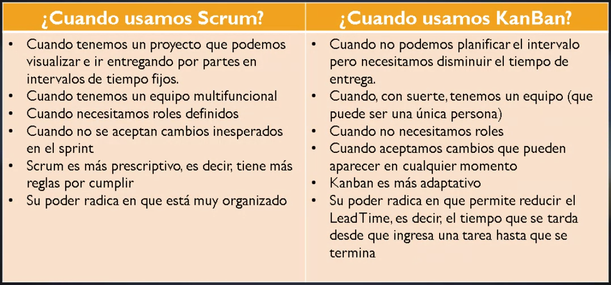
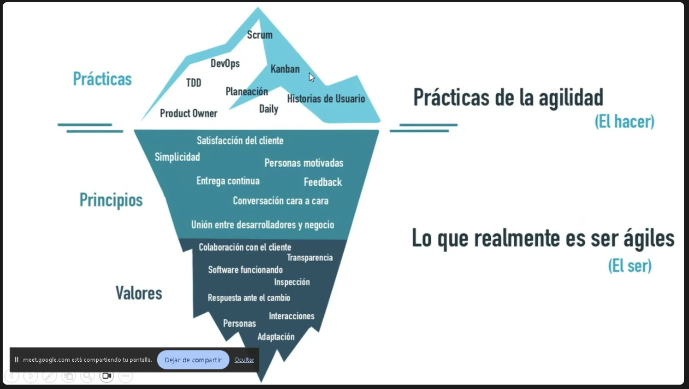

= Notas de Clase, Ingeniería de Software
Daniel
:stem:

== TODO

* [ ] Acomodar notas de clase
* [ ] Terminar apuntes

. Acomodar notas de clases
. Resumir apuntes

== Primera Clase

== Segunda Clase

== Tercera Clase, 29 de Agosto

Pasamos a otro revisar otra metodología ágil: *Kanban*.

=== Kanban

Primera observación: hay gente y papelitos.

.Definición
Nombre japonés, significa tarjeta visual. Nace en Toyota. Venían utilizando
*Lean* y desde ahí pasan a *Kanban*. Sería una versión mejorada de _Lean_.
Al día de la fecha siguen usando Kanban.

.Objetivo.
Gestionar de manera general cómo se van completando las tareas. Ayuda a evitar
dos problemas:

* Cuellos de botella. Acumulación de tareas en una sola persona, que teniendo
muchas cosas para hacer, se retrasa.

* Tiempo muerto. Persona del equipo sin tareas asignadas. No está colaborando.

En _Scrum_ estas situaciones no se pueden visualizar claramente. La única manera
en que se vería es con alguien manifestándolo en la _Daily_.

.Principios.
- Calidad garantizada. No importa el tiempo, sino la calidad. No se premia la
rapidez. Muchas veces cuesta más arreglar que hacer con errores. Lo que se hace,
se hace una vez y bien. Se estudia qué es lo mejor y se hace una sola vez. No se
busca el ensayo y error.
- Reducción del desperdicio. Principio YAGNI. Hacemos lo justo y necesario.  Y
lo hacemos bien.
- Mejora contínua. No es solo un método de gestión. Es un sistema de mejora en
el desarrollo de proyectos.
- Flexibilidad. Lo que se va a realizar se decide en el _backlog_, o tareas
pendientes acumuladas.

.Pasos para aplicar la estrategia
- Todos somos integrantes del equipo. No hay nadie que de órdenes, pero
puede haber un _dinamizador_, que se encarga de resolver problemas.
- Qué vamos a utilizar. Un tablero, _Kanban Board_ y tarjetas.
- Vamos a hacer reuniones, 15 minutos como máximo, de pie y mirándonos a la
cara. Tenemos reuniones diarias de ser necesario, retrospectivas de ser
necesario.
- Elemento clave es wl WIP (_Work in Progress_). Definir cuántas tareas, como
máximo, se puede realizar en cada fase.
- Definir el flujo de trabajo de los proyectos.
- Visualizar las fases del ciclo.

El tablero Kanban clásico se divide en tres columnas. La primera contiene las
_Tareas por Hacer_. La del medio contiene las _Tareas en Progreso_. La de la
derecha son las _Tareas Terminadas_. Cada uno identifica un color de papel.
Cuando detecto una tarea, incorporo a la primera. Cuando empiezo una tarea,
paso a la segunda columna. Cuando termino, va a la del final.

La del medio es el Work In Progress. WIP. Ponemos un límite al WIP. Por ejemplo,
10. Viendo el tablero, se pueden identificar tiempos muertos: no hay ninguna de
un determinado color. Puedo identificar cuellos de botella: hay muchos papelitos
de un mismo color.

Lema *Stop Starting, Start Finishing*. Lo que hacemos, lo hacemos bien de una.
No tenemos margen de error. No empezamos una tarea nueva hasta no finalizar la
anterior. Esto es la aplicación de un principio de las metodologías
tradicionales: como la cascada, hasta que algo no esté, no pasamos a lo
siguiente.

.Conformación de un equipo Kanban.
Equipo compuesto por una persona o cincuenta.  Una sola persona puede aplicar
Kanban. Los equipos remotos puede utilizar soluciones de Software como Trello.

=== Scrumban

Qué criterios podemos usar. Calidad o Tiempo: Kanban o Scrum.

El cliente prioriza calidad, por lo tanto, empezamos a trabajar con Kanban. Se
vuelve caótico. Qué hacemos.

Como Kanban es flexible, le puedo agregar cosas de Scrum. Porque Kanban es
_flexible_. Por ejemplo, estamos teniendo problemas de organización.
Incorporamos un _Product Owner_. O necesitamos reuniones más periódicas,
incorporamos el concepto de _Daily_.

En cuanto incorporamos algo de Scrum a Kanban, hablamos de Scrumban. No es un
cambio de metodología. Por eso se puede hacer.

== Cuarta clase, 5 de septiembre

=== Lean

Metodología ligera, sin muchas complicaciones.
Enfocada en la eficiencia, el aprendizaje contínuo y la entrega rápida de valor.
Es decir, comparte algunos aspectos con SCRUM (entrega rápida), comparte valores
con Kanban (eficiencia, aprendizaje continuo).
Pero es distinta.

Nace en Toyota, década del 50.
Se basa en la eliminación de desperdicios y la mejora contínua (Kaizen).
Cada vez que hacemos algo lo hacemos mejor.

Lo que hacemos en tanto ingenieros de software es adaptar los principios de Lean
a la industria del software (nació en la industria automotriz).
Buscamos maximizar valor, minimizar desperdicios.

.Principios
. Elminar desperdicios
. Ampliar aprendizaje
. Decidir lo más tarde posible
. Entregar lo más rápido posible
. Construir calidad desde el inicio
. Ver el todo

.Eliminar desperdicio
Lo que no agrega valor se elimina.
Código innecesario, funcionalidades no usadas, etc.

.Ampliar aprendizaje
Validación temprana, ciclos cortos de retroalimentación, entregas frecuentes y
prototipos.
Sin pulir detalles.

.Decidir lo más tarde posible
No tomamos decisiones a las apuradas.
Las tomamos cuando se dispone de la mayor cantidad posible de información.

.Entregar lo más rápido posible
Entregas tempranas que generen _feedback_ y adaptar a las necesidades del
cliente.

.Empoderar al equipo
Equipos autónomos, colaborativos y responsables de sus decisiones.

.Construir calidad desde el inicio
Integración contínua, pruebas automatizadas y prácticas de desarrollo que
aseguren calidad desde el principio.

.Ver el todo
Optimizamos el sistema completo, no partes individuales.
Se busca la eficiencia general, no la particular.
No sirve un sistema de 7 módulos con uno eficiente y el resto no.
Eso genera desperdicio, contrario a la filosofía de Lean.

.Ventajas
- Menor tiempo de entrega
- Mayor calidad
- Mejor colaboración
- Satisfacción del cliente
- Alta adaptabilidad a cambios frecuentes

.Requerimientos
- Cambio cultural profundo.
Acostumbrarse a cumplir con todos estos requisitos a rajatabla.
- Gran compromiso organizacional.
Para asumir el cambio cultural necesario.
- Demanda liderazgo distribuido y madurez en procesos.
A diferencia del resto, aquí no existen roles.
No hay _scrum master_, _product owner_ ni dinamizador (Kanban).
Por eso requiere cambio cultural y compromiso organizacional.

Por ejemplo,
si estamos asesorando a una organización y queremos implementar Lean,
sin el compromiso organizacional y el cambio cultural profundo,
es imposible de implementar.

=== Extreme Programming (XP)

No abarca a toda la organización ni al diseño de un proyecto.
Es exclusiva del equipo que se dedica a programar.
Es decir, abarca solo la etapa de desarrollo.

Metodología creada por Kent Beck.
Busca mejorar la calidad del software.
Y la capacidad de adaptación al cambio.

.Objetivos
. Entregar software funcional rápidamente
. Reducir errores mediante pruebas constantes
. Facilitar cambios en requerimientos
. Mejorar la comunciación con el cliente
. Aumentar calidad del código

.Valores
. Comunicación: colaboración continua entre todos
. Simplicidad: desarrollar solo lo necesario
. Feedback: retroalimentación rápida y frecuente por parte del cliente
. Coraje: capacidad para refactorizar (rehacer una solución) y cambiar.
En algunas situaciones es preferible rehacer una solución que corregir una
hecha.
. Respeto: trabajo colaborativo y confianza mutua

.Principales prácticas
. _Pair programming_, programar en parejas
. Desarrollo guiado por pruebas (Test Drive Development)
. Integración contínua
. Refactorización constante
. Pequeñas entregas frecuentes
. Propiedad colectiva del código

.Pair Programming
Dos trabajan en la misma tarea.
Uno escribe y el otro revisa en tiempo real.
Y viceversa.
Permite mejorar la calidad y reducir errores.
Favorece el aprendizaje y la colaboración.

Tiene algunos desafíos.

* Las parejas tienen que compartir estilo de programación
* El armado de las parejas puede ser complicado
  ** Por malos entendidos, problemas personales.
  ** Por diferencias grandes en experiencia:
  uno no tiene mucho que enseñar al otro.

.Propiedad colectiva del código
El código pertenece al cliente.
Es como cuando el arquitecto hace una obra.
Está obligado a entregar el plano.
Esto siempre hablando de software a pedido.

Si vendemos productos terminados no estamos obligados.

Esto no incluye los _scripts_ propios que nos hacemos para automatizar.

.Test Driven Development
Primero se escribe la prueba.
Se desarrolla el mínimo código necesario.
Se refactoriza si hace falta.
Y arranca de nuevo el ciclo.

Por eso se dice ciclo _red, yellow, green_.

.Integración contínua
El código se integra varias veces por día.
Se prueba el código completo.
Las pruebas automáticas verifican que todo funcione.
Permite detectar rápido errores.
Reduce problemas de integración al final del proyecto.

.Ciclo de vida
. Recolectamos historias de usuario
. Planificamos la iteración
. Desarrollo y pruebas
. Entrega incremental
. Feedback
. Volvemos a 1

.Ventajas de XP
. Alta calidad de software
. Mayor satisfacción

.Desventajas
. Requiere compromiso por parte del cliente
. Puede ser difícil de aplicar en equipos grandes
. Necesita disciplina técnica constante
. Pair Programming puede generar resistencias

.XP vs Metodologías Tradicionales
. Iteraciones cortas
. Participación continua del cliente
. Documentación liviana y práctica

.Conclusión
. Metodología ágil

=== Mitos sobre AGILE

.No son nuevas
La primera nace en 1943 (Kanban), 80 añitos tiene. Es cierto que al principio
se usó para Hardware y es más _reciente_ su paso al _Software_. Pero _no_ son
nuevas.

.Requieren documentación
Hay gente que confunde "Software funcionando por encima de documentación
extensiva" con "No es necesario documentar". El efoque es pensar bien qué,
cuánto y cuándo documentar. No vale la pena documentar todo, desde el principio
y hasta el final. Hay cosas que van a cambiar. Tampoco conviene documentar en
extremo. Documentar lo justo y necesario.

.La agilidad _requiere_ planificación
La planificación en un contexto ágil se refiere como _Planning Onion_. Partimos
por el _Backlog_. Y de ahí arrrancamos. Planificar, hay que planificar siempre.
No es anárquica.

.La agilidad _no_ soluciona todos los problemas
No soluciona problemas de gestión, calidad, ingeniería, clima organizacional,
motivación, compromiso. Si nuestros productos son medio pelo, no va a cambiar
por implementar una metodología ágil.

=== Qué es _realmente_ aplicar metodologías ágiles

No alcanza con las prácticas. Ser ágiles implica asumir los principios y
valores. No por hacer reuniones diarias vamos a ser ágiles.

=== _Product Backlog_

.Columnas del Backlog
. Se numeran requerimientos funcionales/historias de usuario.
. El cliente establece el valor de negocio. En una escala, elige lo más
importante.
. Estimación en minutos del tiempo requerido.
. Costo, refiere al esfuerzo requerido.
. Aceptada, si el cliente ya dio el _ok_.
. Observaciones.

Hay técnicas para estimar costos.

.T-Shirt Sizing
Talles de remeras.
Técnica de estimación relativa.
Le asignamos a cada tarea un talle de remera.

Es una técnica de estimación relativa.
Para *implementarla*. El equipo asigna a cada tarea un valor de remera.
Cada talle representa la dificultad de una tarea.

- XS, trivial
- S, menos de un día
- M, un día
- L, dos o tres
- XL, más de tres o descomposición

Estos valores dependen de la experiencia del equipo.
Un desafío puede ser S para una equipo y L para otro.

Conviene usarla cuando queremos hacer una estimación rápida.
Sirve para reuniones en las que queremos reasignar tareas.
Y actualizar rápidamente el _backlog_.

Entre sus *ventajas* es rápida y fácil, fomenta la colaboración.
Entre sus *desventajas*, menos precisa, subjetiva.
No sirve para medir horas ni *cronogramas.

.Planning Poker
Método de estimación colaborativa.
Suele asociarse con SCRUM.
Usamos valores de la serie de Fibonacci _modificada_:
0, 1, 2, 3, 5, 8, 13, 20, 40, 100.
Cada miembro tiene 10 cartas.
En la reunión, a la hora de estimar la dificultad,
levantamos cartas de acuerdo a la dificultad de la tarea.
Se establecen por mayoría.
Si no hay mayoría, debatimos muy brevemente y levantamos de nuevo.
Votamos y votamos hasta llegar a un acuerdo.

.Three-point Estimation
Estimamos con tres escenarios. Pesimista, probable, optimista. Se calcula como
estimación ponderada. También se conoce como fórmula PERT. (Nada que ver con
el gráfico).

Se hace una cuenta.

[stem]
++++
(O + 4M + P)/6
++++

Al resultado le sumamos y restamos la desviación estándar para tener un rango de
valores.

.Wideband Delphi
Es una técnica de estimación colaborativa y anónima.
Se basa en el método Delphi clásico.
Busca consenso entre expertos mediante múltiples rondas.
Se usa en proyectos con alta incertidumbre.

Wideband Delphi incluye al Product Owner (o al rol equivalente que representa al cliente/negocio) en el proceso de estimación, ya que su presencia es clave para aclarar dudas sobre los requisitos, dar contexto sobre las características solicitadas y validar las suposiciones del equipo antes y durante las rondas de estimación.

== Quinta clase, 12 de septiembre

Hoy vemos tema nuevo. Esto no entra en el primer parcial. Primer parcial: módulo
1 y hasta metodologías ágiles. Semana que viene consultas para el parcial.

Hoy establecemos fechas de entrega para los próximos prácticos. Será para
después del parcial.

=== Gestión de riesgos

.Análisis de riesgos
Se hace en cualquier ámbito. No solo software. Un cirujano tiene muchos riesgos.
*Riesgo* es aquello que _puede llegar a pasar_ y nos puede ocasionar problemas.
Existen muchos riesgos. Vamos a considerar los más típicos, en un momento
determinado.

La gestión de riesgos es dinámica: se va actualizando a medida que avanzamos.
En un principio algo puede ser poco riesgoso e ir incrementando con el tiempo.

.Gestión de riesgo
Consiste en _catalogar_ riesgos, de forma general a formas específicas.

En primera instancia, de forma general, los clasificamos en:

- Riesgos de proyecto: afectan tiempos o recursos, ejemplo, pérdida de un
programador. V. g., se vuela el dólar.
- Riesgos del producto: afectan la calidad o rendimiento del _Software_. Una
rutina tarda mucho, el motor de base de datos no es el adecuado. Otro, de
calidad, un software que cumple con su cometido, pero tiene una mala interfaz,
no es un problema de rendimiento, sino de calidad.
- Riesgos del negocio: afectan a la organización, por ejemplo, otra empresa
ofrece un producto similar a precio menor.

== Clase del 3 de Octubre

Vemos *testing*.

=== Qué son

- Permiten la verificación

=== Ciclo de vida de pruebas

- Shift-left testing

=== Niveles de prueba

Cada nivel valida una porción específica combinando diversos tipos de pruebas.

|===
|Prueba |Objetivo

|*Unitaria*
|Componentes y código aislado.

|*Integración*
|Contratos e interfaces.

|*Sistema*
|Entorno integral completo.

|*Aceptación*
|Conformidad del negocio.
|===

. Unitarias

. Integración

. Sistema

. Aceptación

=== Tipos de prueba

. Funcionales
Comportamiento esperado del sistema.

. Rendimiento
Evaluación bajo carga y estrés.

. Seguridad
Protección contra vulnerabilidades.

.

=== Estrategias y distribución

.Pirámide clásica
Base amplia unitaria, poca capa E2E.

.Diamante/Trofeo
Énfasis en integración

.Cono de Helado (Antipatrón)
Exceso de pruebas manuales y costosas.
Todo _testing_ tiene un costo.
Aquí estamos maximizando costo.

=== Insumos fundamentales

.Casos de prueba
Trazabilidad directa con requisitos.
Testeamos que cada historia de usuario se cumpla.
Comparamos las historias de usuario con el sistema construido.

.Datos de prueba
Datos sintéticos o anonimizados.
Está *prohibido* utilizar datos reales.

.Entornos
Paridad con producción aislada.
Probar en _desktop_, _móvil_.

=== Medición de calidad

Apuntamos a construir _software_ de la mejor calidad posible.
Para eso medimos:

.Cobertura
De código, requisitos y flujos.

.Defectos
Escapados y tiempo MTTD/MTTR

.Feedback
Velocidad de respuesta en *CI/CD*.

.Riesgo de metricolatría
Las métricas deben orientar decisiones, no juzgar personas.

=== Cadena de trazabilidad

. Requisito
. Caso
. Ejecución
. Defecto
. Verificación

=== Inteligencia artificial en QA

.Aportes y valor tecnológico
Acelerador en generación de casos y análisis de _logs_.

.Límite del criterio humano
Es herramienta de asistencia.
No reemplaza la responsabilidad de los equipos humanos.
Automatizar no garantiza calidad.
La IA es un acelerador, no un sustituto.
